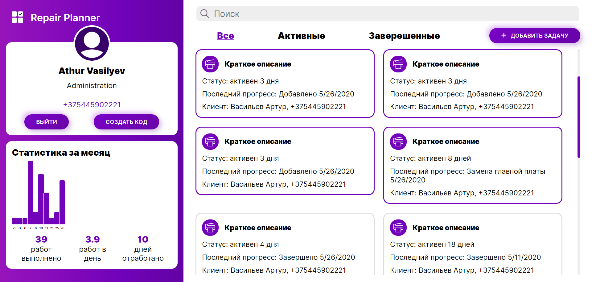
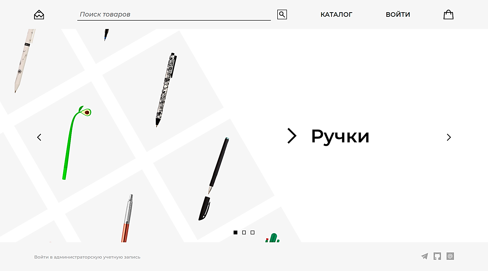
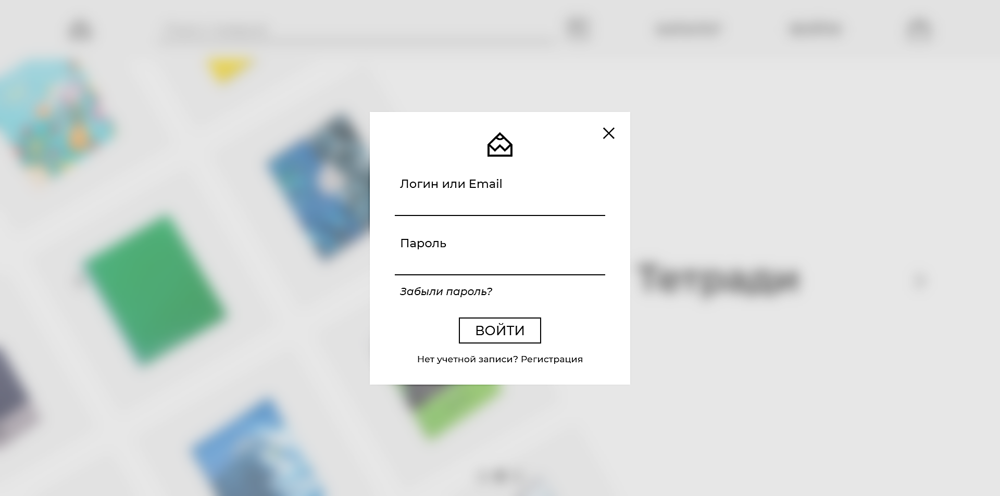
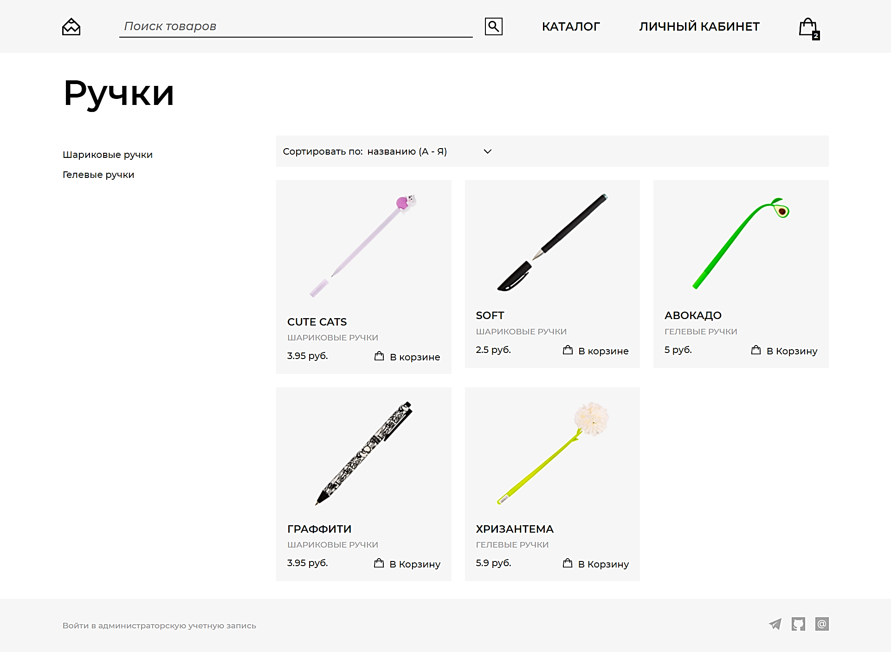
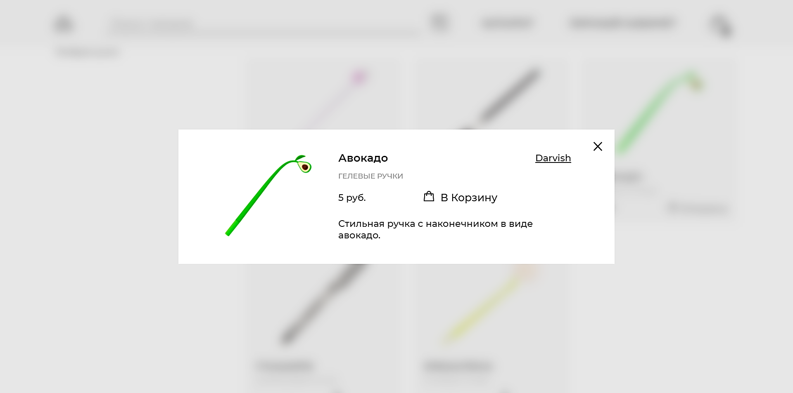
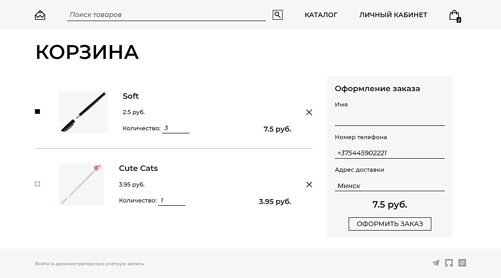
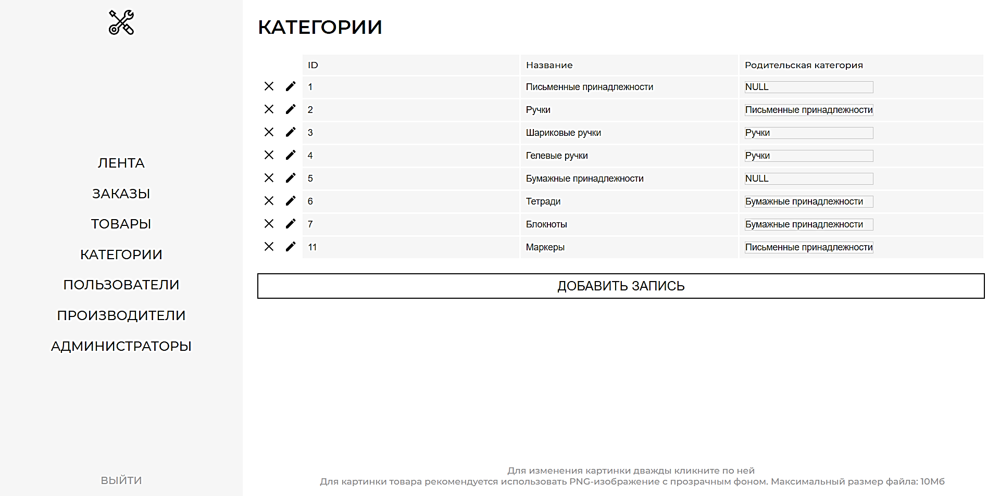

# About me

At the moment I am a 4th-year student of Minsk Radioengineering College where I get a programmer education. During my studies, I managed to try a lot of technologies. I have been making such things as
- desktop applications (*Windows Forms*, *WPF*)
- back-end for websites (*ASP.NET Core MVC*, *PHP*)
- databases (*Entity Framework* + *MS SQL*, *MySQL*)
- client-side for websites (*HTML*, *CSS*, *JavaScript* with libraries *jQuery* and *SVG.js*)
- mobile games (*Unity*)

My friends and acquaintances often highlight such my qualities as:
 - **Creativity.** Often I can come up with and create something non-standard and unusual that other people might like. 
 - **Perseverance.** I am able to sit at work for a long time, without stopping, to be patient in many classes. 
 - **Responsibility.** I always take my work seriously, especially when people rely on me.

I think to myself that I am a perfectionist. I can spend a lot of time bringing everything to perfection. The feeling that I did everything perfectly raises my mood and calms me down.

# Interests

- **Programming.** I chose the profession of a programmer. I was always impressed by how the text with the code turned into a real program that solves different problems.
- **Computer graphics.** I like to create on the computer any things that require creativity, especially related to graphics and UI design.
- **Videogames**

# My projects

## Repair Planner
*[(link to a repository)](https://github.com/Arthur16518/Repair-Planner)*

This is the course project for a program design subject. The main objective of this project was to use OOP and a database. I implemented this task in the form of a website.
Technologies used:
- ASP.NET Core MVC
- Entity Framework + Microsoft SQL
- HTML
- CSS
- JavaScript + AJAX library

### Start page with sign-in and sign-up forms
*[you can check this page here](https://arthur16518.github.io/Repair-Planner-login-page)*

### Page with main functionality

## Stationery Shop
*[(link to a repository)](https://github.com/Arthur16518/Stationery-Shop)*

Stationery online shop is the course project for databases subject. The website has functionality for content management and was made by MVC pattern on pure PHP.
Technologies used:
- PHP + PHPMailer library
- HTML
- CSS
- JavaScript

### Home page

### Log-in form

### Catalog

### Product description

### Cart page

### CMS-page

# Contact me

[artur.ik16518@gmail.com](mailto:artur.ik16518@gmail.com)

[Telegram](https://t.me/str165)

[+375 44 590 22 21](tel:+375445902221)
